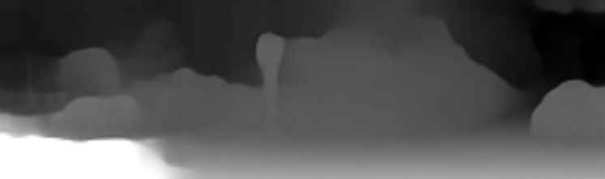

# DaVIS
 DaVIS is a Data Visualiser Tool for visualising data in various unconventional methods to provide more insights

## AudioVis
### Audio Spectrogram Visualiser
   - Plots spectrograms of audio files
   
   
   
   
## ImageVis
### Image Point Effects
   - Generating Fun 3D Effects from Images
   
   
   

### Image 3D Model Generator
   - Generating 3D models from images using depth based on various factors
   
      - GrayScale Depth

         

         

         

      - AI Depth

         

         

         

### Image 2D Visualiser
   - Generating Fun Visualisations of Images

      - Split RGB Channels in images
   
      

      - View dominant colours only in a image
   
      

      

      - Histogram Enhance Images
   
      

      - View Image Histograms
   
      

## AlgoVis

 - Moved to a separate repo: [https://www.github.com/KausikN/AlgoVis](AlgoVis)